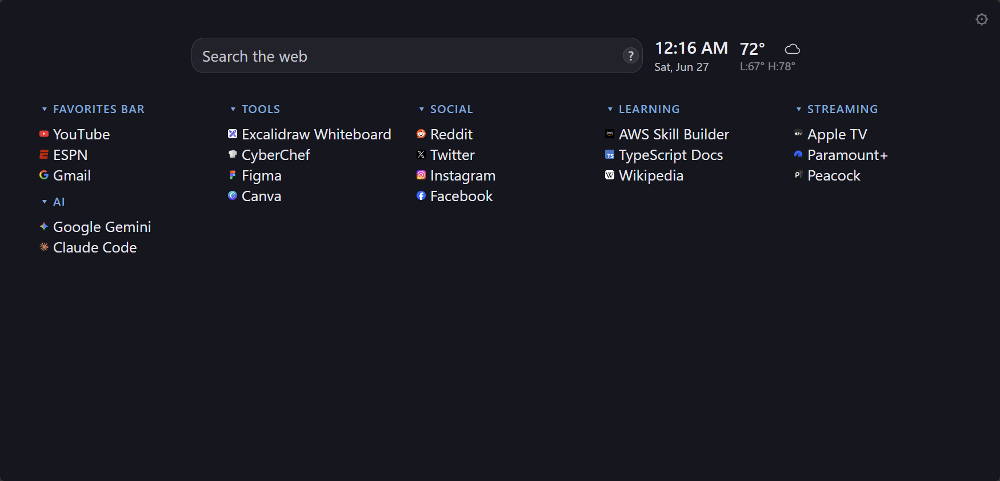
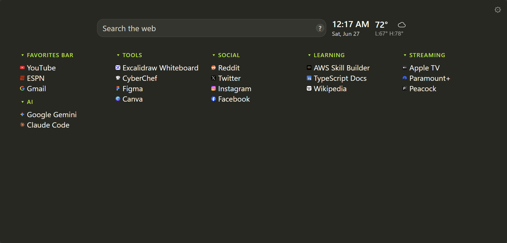
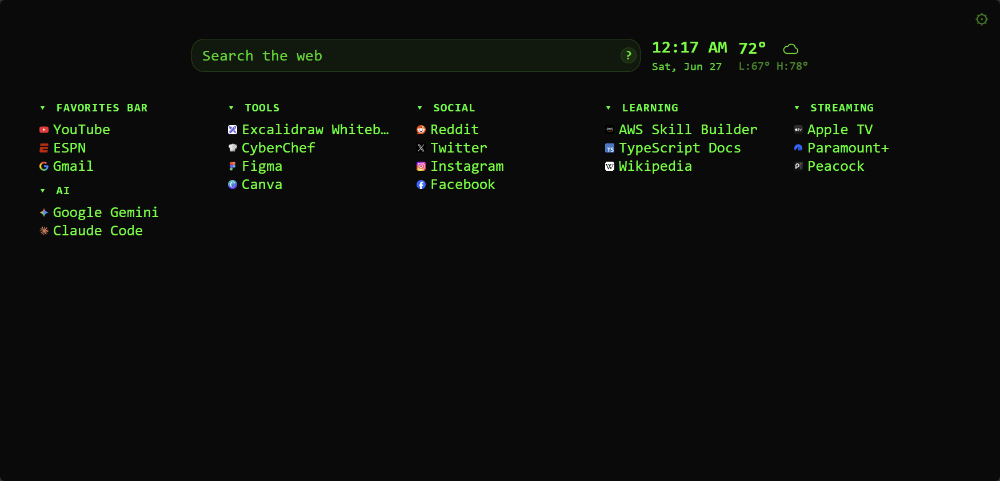
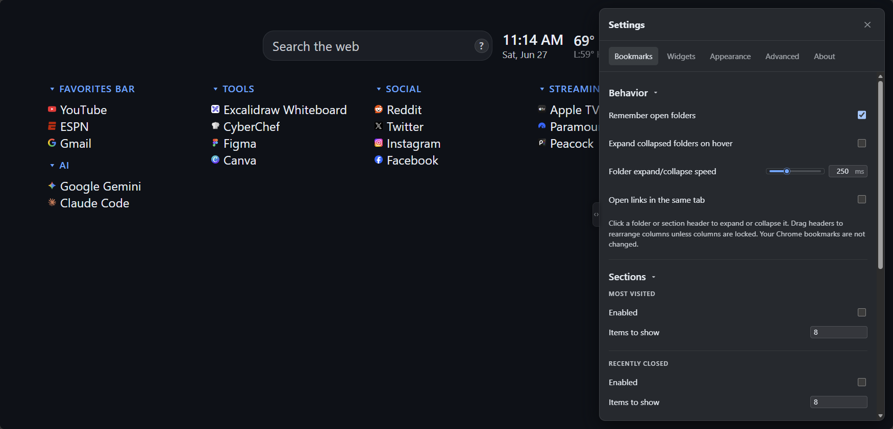
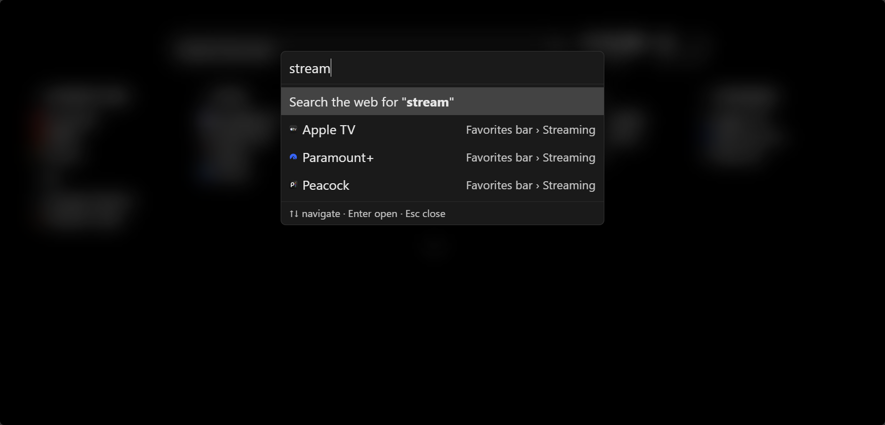

<p align="center">
  
</p>

# New Tab Plus

A bookmarks-driven, widget-extensible new tab page for Chrome.

**Website:** [User guide & privacy policy](https://tpbnick.github.io/new-tab-plus/)

Inspired by [Humble New Tab Page](https://github.com/ibillingsley/HumbleNewTabPage).

## Screenshots

<p align="center">
  
</p>

<p align="center">
  
  
  
</p>
<p align="center"><em>GitHub Dark · Monokai Dark · Hacker</em></p>

<p align="center">
  
</p>

<p align="center">
  
</p>

## Install

1. Download **`new-tab-plus-v*.zip`** from the [latest release](https://github.com/tpbnick/new-tab-plus/releases/latest).
2. Unzip the file.
3. Open `chrome://extensions`, enable **Developer mode**, and choose **Load unpacked**.
4. Select the unzipped folder (it should contain `manifest.json`).

## Development

```bash
npm install
npm run dev     # watch + dev server
npm test        # run tests
npm run build   # build dist/
npm run package # zip dist for release
```

Weather data is fetched from [Open-Meteo](https://open-meteo.com/) when the weather widget is enabled (requires network access).

## Possible Upcoming Features
- Calendar integration (Google, Apple)
- Sports Livescores integration (Soccer, Basketball, Football, etc.)
- Weather source options (Bring your own API key)
- More theme/font options

## License

[MIT](LICENSE)
